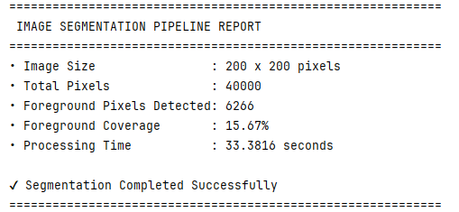

\# 🖼 Image Processing \& Foreground Segmentation


A complete image enhancement and segmentation pipeline built using Python and OpenCV.


\## 🚀 Features


\- Image sharpening

\- Image smoothing

\- Sobel edge detection

\- Binary thresholding

\- Morphological cleaning

\- Region growing segmentation

\- Foreground extraction


\## 🛠 Technologies Used


\- Python

\- OpenCV

\- NumPy

\- Matplotlib


\## 📊 Output Visualization


### Segmentation Pipeline Result


---

### Console Execution Report




\## ▶ How to Run


```bash

pip install -r requirements.txt

python main.py


